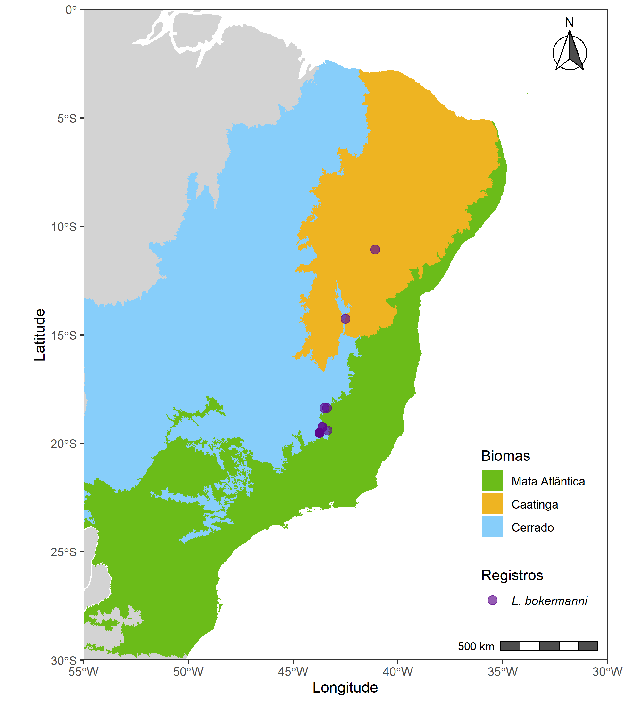

 
<style>
body {
text-align: justify}
</style> 
 
```{r setup, include=FALSE}
knitr::opts_chunk$set(echo = TRUE)
```

# Resumo

As mudanças climáticas em ocorrência no planeta são foco crescente de estudos na área ecológica.
A modificação na distribuição geográfica das espécies é um dos inúmeros impactos que as alterações
no clima podem causar nas comunidades de espécies, comprometendo o funcionamento de ecossistemas 
e interações ecológicas entre indivíduos. Dessa forma, como resposta às mudanças climáticas, 
as espécies tendem a adaptar sua distribuição
a lugares mais adequados. Porém, se a adequação não for acompanhada também pela adaptação das 
outras espécies com os quais há relações ecológicas importantes, pode ocorrer o chamado 
*mismatch* espacial entre elas, que é dada pela não sobreposição geográfica das espécies.
O presente projeto busca compreender como as mudanças climáticas podem impactar a distribuição 
geográfica da espécie de quiróptero *Lonchophylla mordax* e do arbusto 
*Mimosa lewisii*,duas espécies que possuem relações ecológicas valiosas, sendo *L. mordax* o único 
polinizador conhecido de *M. lewisii*. Utilizando-se de Modelos de Distribuição de Espécies 
(MDEs) serão criados modelos de distribuição potencial das espécies de quiróptero e vegetal em
dois futuros cenários climáticos projetados, de RCP 4.5 e 8.5. O potencial algoritmo a ser 
utilizado para a modelagem é o MaxEnt. Os modelos gerados mais adequados serão analisados a fim
de verificar alterações na distribuição futura das espécies *L. mordax* e *M. lewisii* em 
comparação com a distribuição atual,examinando e quantificando a ocorrência do *mismatch* 
espacial entre planta e polinizador.


>**Palavras chave:** Mudanças climáticas, distribuição de espécies, modelagem, sobreposição de espécies.

>**Área do conhecimento:** Ecologia.


\clearpage

# Introdução


```{r plot_bokermanni, echo=FALSE, fig.align='center', fig.cap='Gráfico das localidades de L. bokermanni ', fig.width=6}


```

    


Outra forma de citar @nascimento2013

\clearpage

```{=tex}
\clearpage
\bibliography{bibliography.bib}  
\clearpage
```

# Referências


