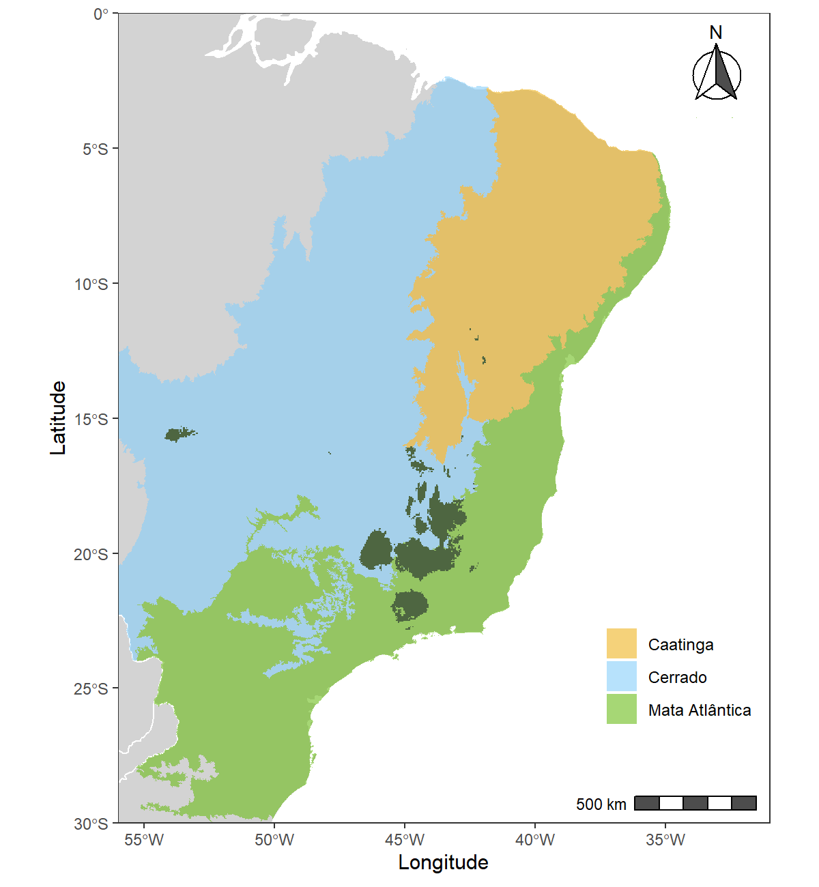
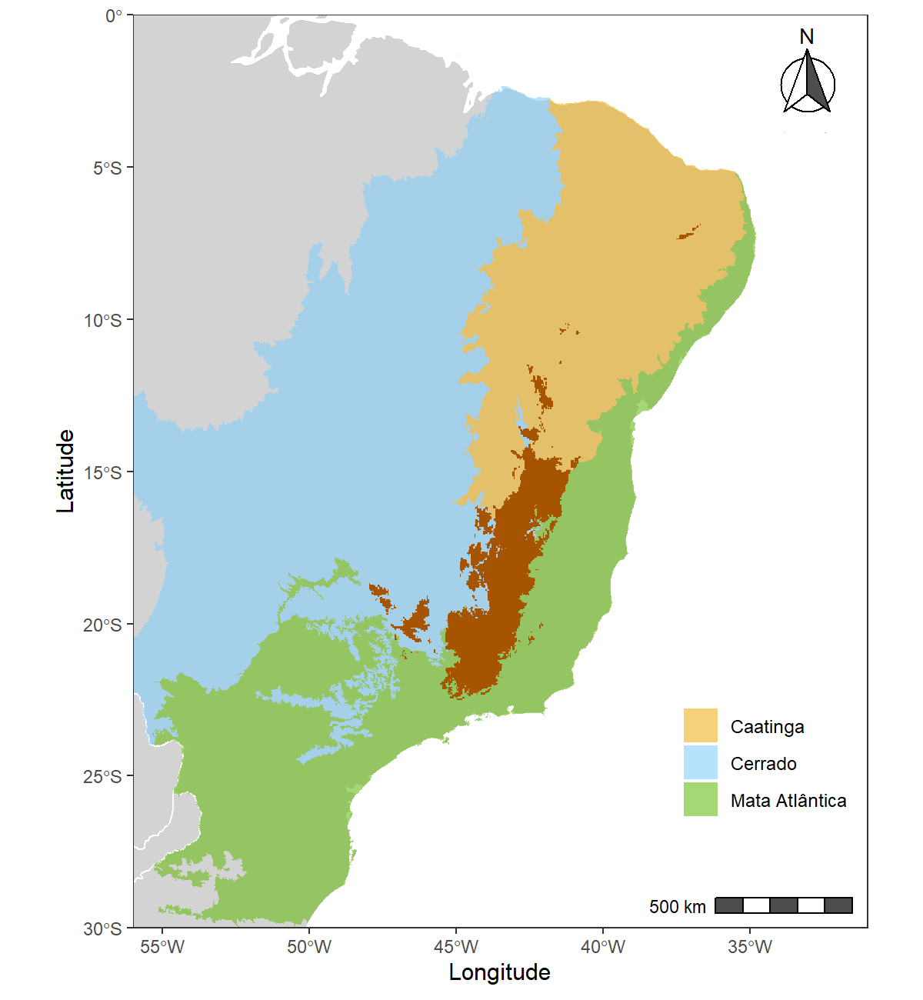

---
output:
  pdf_document: 
    keep_tex: yes
  html_document:
    df_print: paged
    toc: yes
    theme: united
editor_options:
  markdown:
    wrap: sentence
intent: yes
link-citations: yes
linestretch: 1.25
indent: yes
fontsize: 11pt
csl: associacao-brasileira-de-normas-tecnicas-eceme.csl
---

# Anexos

## Tabelas

|  Tabela 3: Pontos de ocorrências de *Encholirium subsecundum* (Barker Mez).

|Estado       |  Município| Longitude | Latitude  | Referência |
--------------|-----------|-----------|-----------|-----------|
| Minas Gerais|Belo Horizonte| -43.93780 | -19.92080 | Fundação Zoo-Botânica de Belo Horizonte|
| Minas Gerais | Santana do Riacho | -43.71440 | -19.16890 | Fundação Zoo-Botânica de Belo Horizonte|
| Minas Gerais | Conceição do Mato Dentro | -43.42500 | -19.03720 | Fundação Zoo-Botânica de Belo Horizonte|
| Minas Gerais | Serro| -43.37940 | -18.60470 | Coleção da Escola Superior de Agronomia Luiz de Queiroz - USP |
| Minas Gerais | Serro| -43.44500 | -18.47250 | Herbário do Museu Nacional|
| Minas Gerais | Jequitaí| -44.44560 | -17.23560 | Coleção da Universidade Federal de Viçosa|
| Minas Gerais | Buenópolis| -44.18000 | -17.87330 | Coleção da Universidade Federal de Viçosa|
| Minas Gerais | Buenópolis| -44.23389 | -17.92389 | Coleção da Universidade Federal do Maranhão|
| Minas Gerais | Buenópolis| -44.24944 | -17.90917 | Coleção da Universidade Federal do Maranhão|
| Minas Gerais | Santana do Riacho| -43.71440 | -19.16890 | Coleção da Universidade Federal de Viçosa|
| Minas Gerais | Mariana| -43.41610 | -20.37780 | Coleção da Universidade Federal de Viçosa|
| Minas Gerais | Datas| -43.65580 | -18.44560 | Herbário do Museu Botânico Municipal|
| Minas Gerais | Joaquim Felício| -44.17220 | -17.75750 | Coleção da Universidade Estadual de Feira de Santana|
| Minas Gerais | Joaquim Felício| -44.29190 | -17.69890 | The New York Botanical Garden|
| Minas Gerais | Joaquim Felício| -44.17220 | -17.75750 | Herbário da Universidade Estadual de Feira de Santana|
| Minas Gerais | Santana do Riacho | -43.71440 | -19.16890 | Instituto de Botânica|
| Minas Gerais | Penha da França | -43.83333 | -18.83333 | Coleção da Universidade de Brasília|
| Minas Gerais | Montes Claros  | -43.86170 | -16.73500 | Coleção da UNICAMP|
| Minas Gerais | Santo Antônio do Itambé  | -43.33944 | -18.45694 | Herbário da UFMG|
| Minas Gerais | Pedro Leopoldo| -44.04310 | -19.61810 | Herbário da UFMG|
| Minas Gerais | Itacambira| -43.30890 | -17.06470 | Herbário da UFMG|
| Minas Gerais | Dom Joaquim| -43.23333 | -18.86667 | Herbário do Museu do Jardim Botânico do Rio de Janeiro|
| Minas Gerais | Mato Verde| -42.77889 | -15.38667 | Herbário do Museu do Jardim Botânico do Rio de Janeiro|
| Minas Gerais | Santana de Pirapama | -43.75556 | -19.00611 | Herbário do Museu do Jardim Botânico do Rio de Janeiro |
| Minas Gerais | Diamantina | -43.55278 | -18.35500 | Herbário do Museu do Jardim Botânico do Rio de Janeiro |
| Minas Gerais | Diamantina | -43.62806 | -18.19194 | Herbário do Museu do Jardim Botânico do Rio de Janeiro |
| Minas Gerais | Presidente Kubitschek | -43.55722 | -18.65389 | @mariana2014 |
| Minas Gerais | Santana do Riacho | -43.51667 | 19.25000  | Herbário da UFMG |
| Bahia | Itatim | -39.69810 | -12.71190 | Instituto de Botânica|
| Minas Gerais | Jaboticatubas| -43.74500 | -19.51360 | The New York Botanical Garden|
| Minas Gerais | Jaboticatubas| -43.58333 | -19.16667 | Herbário do Museu Nacional|

\clearpage

Tabela 4: Pontos de ocorrências de *Lonchophylla bokermanni* (Sazima, Vizotto & Taddei).

| Estado       | Município      | Longitude  | Latitude   | Referência|
|--------------|----------------|------------|------------|-----------|
| Minas gerais | Jaboticatubas| -43.74472  | -19.51361  | Coleção de Mamíferos do Museu de Zoologia da UNICAMP |
| Minas gerais | Jaboticatubas| -43.60000  | -19.270000 | @nascimento2013|
| Minas gerais | Serra do Cipó| -43.60000  | -19.26667  | Coleção de Mamíferos do Museu de Zoologia da UNICAMP |
| Minas gerais | Itambé do Mato Dentro | -43.349444 | -19.410278 | @nascimento2013|
| Minas gerais | Diamantina| -43.516667 | -18.383333 | @dias2013|
| Minas gerais | Diamantina| -43.383333 | -18.383333 | @almeida2016|
| Bahia        | Caetité   | -42.500000 | -14.266667 | @claudio2018|
| Bahia        | Ourolândia| -41.083333 | -11.083333 | @claudio2018|

\clearpage

Tabela 5: Descrição das variáveis bioclimáticas derivadas de valores de temperatura e pluviosidade [@worldclim].

| Variáveis bioclimáticas |                           Descrição                            |
|:-----------------------:|:--------------------------------------------------------------:|
|          Bio 1          |                    Temperatura média anual                     |
|          Bio 2          | Intervalo médio diurno (Média mensal (máx. temp. - mín temp.)) |
|          Bio 3          |                         Isotermalidade                         |
|          Bio 4          |       Sazonalidade de Temperatura (desvio padrão \*100)        |
|          Bio 5          |             Temperatura máxima do mês mais quente              |
|          Bio 6          |              Temperatura mínima do mês mais frio               |
|          Bio 7          |                 Intervalo da temperatura anual                 |
|          Bio 8          |        Média da temperatura do quarto de ano mais úmido        |
|          Bio 9          |        Média da temperatura do quarto de ano mais seco         |
|         Bio 10          |       Média da temperatura do quarto de ano mais quente        |
|         Bio 11          |        Média da temperatura do quarto de ano mais frio         |
|         Bio 12          |                       Precipitação anual                       |
|         Bio 13          |                 Precipitação do mês mais frio                  |
|         Bio 14          |                 Precipitação do mês mais seco                  |
|         Bio 15          |     Sazonalidade de precipitação (Coeficiente de variação)     |
|         Bio 16          |            Precipitação do quadrimestre mais úmido             |
|         Bio 17          |             Precipitação do quadrimestre mais seco             |
|         Bio 18          |            Precipitação do quadrimestre mais quente            |
|         Bio 19          |             Precipitação do quadrimestre mais frio             |

\clearpage

Tabela 6: Valores VIF das variáveis sem problema de colinearidade (VIF \< 10) da espécie *E. subsecundum*.

| Variável | VIF      |
|----------|----------|
| Bio 3    | 4.266921 |
| Bio 4    | 6.135108 |
| Bio 7    | 7.469114 |
| Bio 9    | 2.401162 |
| Bio 13   | 6.836922 |
| Bio 14   | 6.308869 |
| Bio 19   | 4.786559 |

Tabela 7: Valores VIF das variáveis sem problema de colinearidade (VIF \< 10) da espécie *L. bokermanni*.

| Variável | VIF      |
|----------|----------|
| Bio 15   | 1.200694 |
| Bio 18   | 1.200694 |


\clearpage
Tabela 8: Contração, expansão ou não alteração relativa (em porcentagem) para a espécie de planta e morcego sob os dois cenários climáticos futuro, com relação à distribuição presente.

+---------------------------+----------------+-----------+-----------+-------------------+
| Espécie                   | Cenário        | Ganho (%) | Perda (%) | Sem alteração (%) |
+===========================+================+===========+===========+===================+
| *Lonchophylla bokermanni* | RCP 4.5 (2050) | 0.67      |  37.65    | 61.68             |
+---------------------------+----------------+-----------+-----------+-------------------+
|                           | RCP 8.5 (2050) | 0.06      |  58.12    | 41.81             |
+---------------------------+----------------+-----------+-----------+-------------------+
| *Encholirium subsecundum* | RCP 4.5 (2050) | 0.08      |  72.78    | 27.14             |
+---------------------------+----------------+-----------+-----------+-------------------+
|                           | RCP 8.5 (2050) | 0.00      |  81.11    | 18.89             |
+---------------------------+----------------+-----------+-----------+-------------------+


Tabela 9: Distribuição sem sobreposição (desencontro geográfico) entre planta e morcego nos três cenários climáticos.

+---------------------------+----------------+--------------------------------+--------------------------------------------------------------+
| Espécie                   | Cenário        | Área de desencontro geográfico | Porcentagem com relação à distribuição da espécie no cenário |
+===========================+================+================================+==============================================================+
| *Lonchophylla bokermanni* | Presente       | 130263.7                       | 26.07                                                        |
+---------------------------+----------------+--------------------------------+--------------------------------------------------------------+
|                           | RCP 4.5 (2050) | 190714.7                       | 61.56                                                        |
+---------------------------+----------------+--------------------------------+--------------------------------------------------------------+
|                           | RCP 8.5 (2050) | 127101.0                       | 63.07                                                        |
+---------------------------+----------------+--------------------------------+--------------------------------------------------------------+
| *Encholirium subsecundum* | Presente       | 144095.6                       | 28.06                                                        |
+---------------------------+----------------+--------------------------------+--------------------------------------------------------------+
|                           | RCP 4.5 (2050) | 21127.3                        | 15.07                                                        |
+---------------------------+----------------+--------------------------------+--------------------------------------------------------------+
|                           | RCP 8.5 (2050) | 22603.2                        | 23.30                                                        |
+---------------------------+----------------+--------------------------------+--------------------------------------------------------------+


\clearpage
## Figuras


```{r vif, echo=FALSE, fig.align='center', fig.cap='Importância relativa das variáveis para o modelo cheio da espécie de planta (acima) e para o morcego (abaixo).', fig.show="hold", out.width="73%"}

knitr::include_graphics(c("../Rmarkdown/importancia_vars_planta.png", "importancia_vars_morcego.png"))

```

\clearpage

```{r VIF_subs, echo=FALSE, fig.align='center', fig.cap='Matriz de correlação entre as variáveis bioclimáticas para a espécie E. subsecundum (à esquerda) e L. bokermanni (à direita)', fig.show="hold", out.width="49%"}

knitr::include_graphics(c("../Dados/Resultados_VIF/E_subsecundum/Corr_plot_19_biovars.png","../Dados/Resultados_VIF/L_bokermanni/Corr_plot_19_biovars.png"))

```


{width="80%"}

{width="80%"}


{width="100%"}


{width="100%"}

{width="100%"}

{width="100%"}


{width="100%"}


{width="100%"}

{width="100%"}

{width="100%"}


{width="100%"}

{width="100%"}


