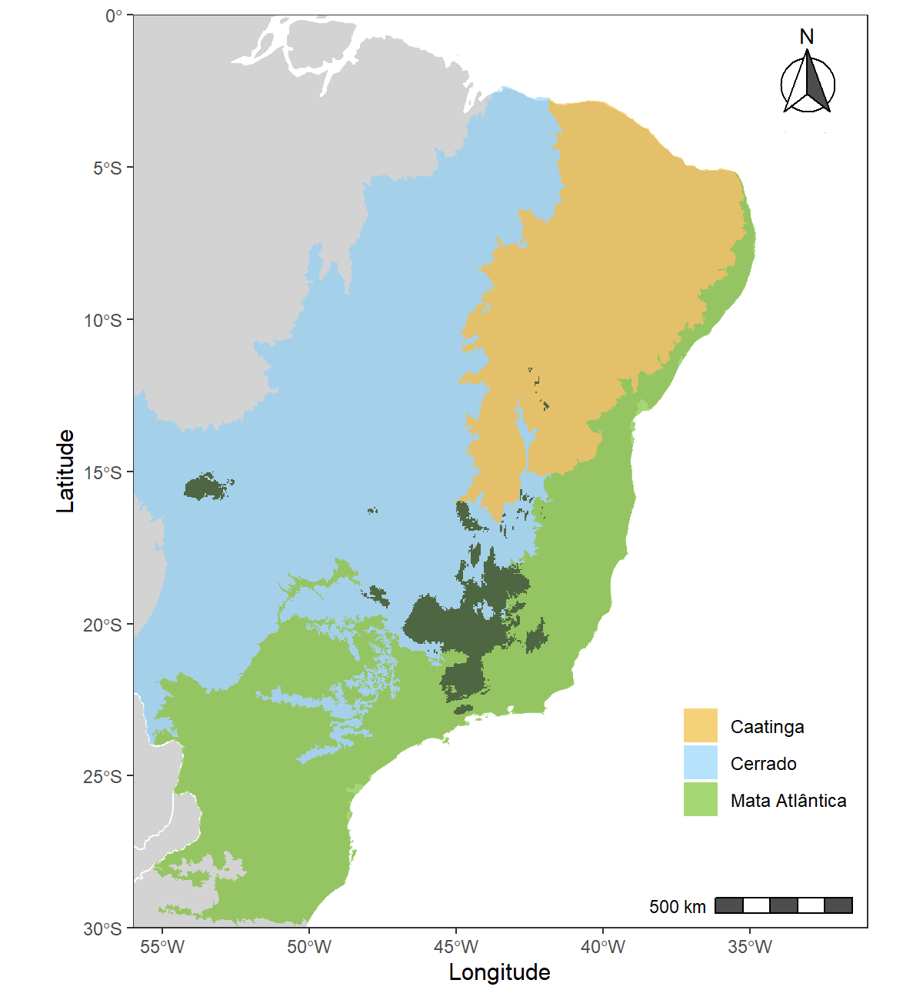
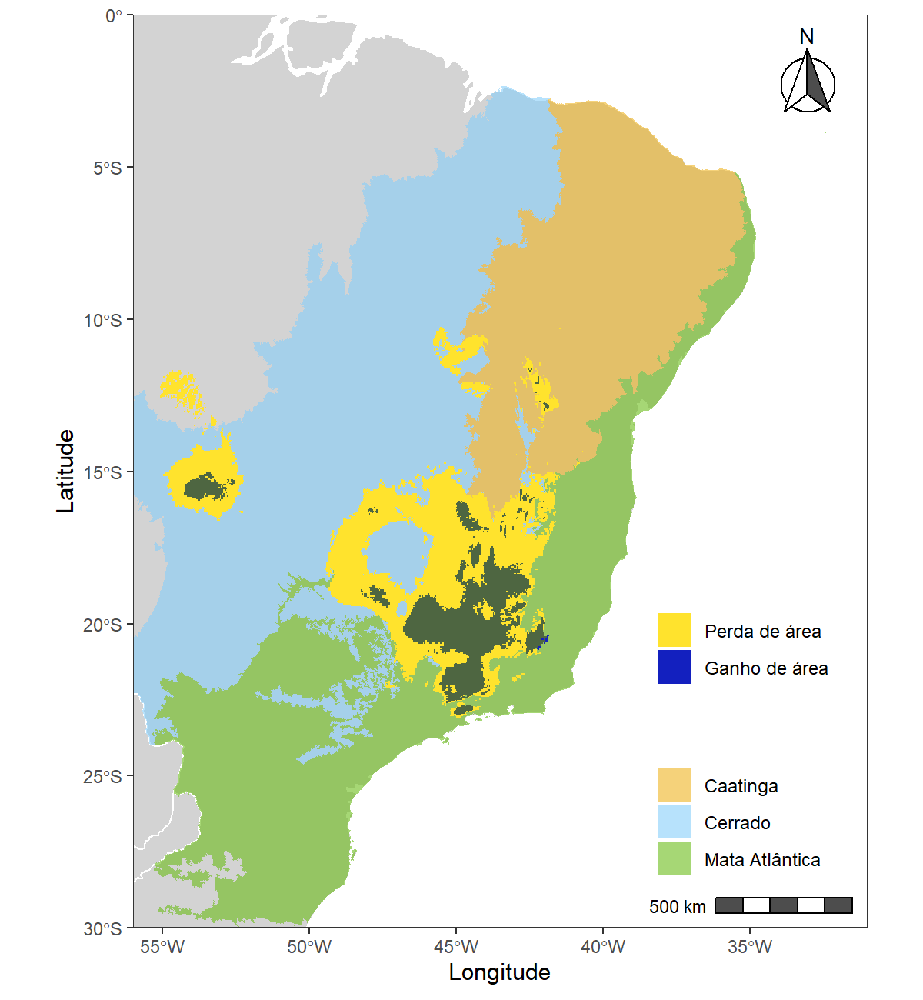
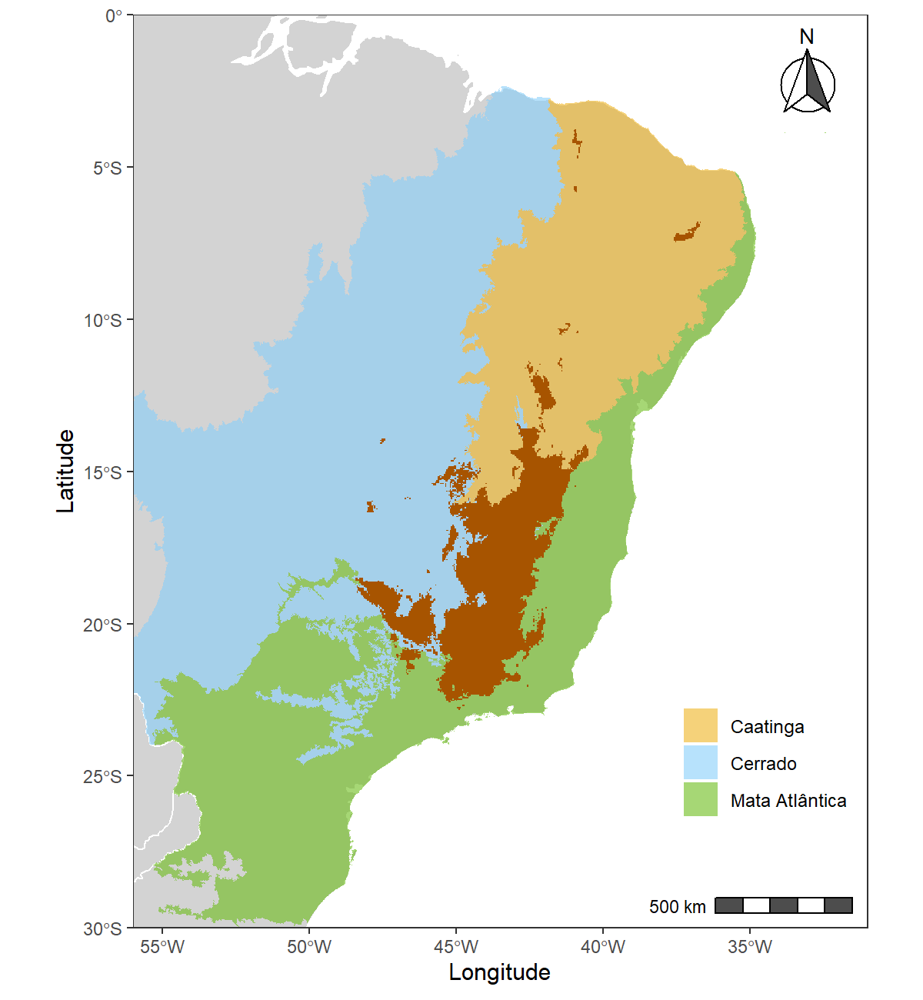

---
output:
  pdf_document:
    latex_engine: xelatex
  html_document:
    df_print: paged
    toc: yes
    theme: united
editor_options:
  markdown:
    wrap: sentence
intent: yes
link-citations: yes
linestretch: 1.25
indent: yes
fontsize: 11pt
csl: associacao-brasileira-de-normas-tecnicas-eceme.csl
---

# Apêndice

## Tabelas

|  **Tabela 1:** Pontos de ocorrências de *Encholirium subsecundum* (Barker Mez).

|Estado       |  Município| Longitude | Latitude  | Referência |
--------------|-----------|-----------|-----------|-----------|
| Minas Gerais|Belo Horizonte| -43.93780 | -19.92080 | Fundação Zoo-Botânica de Belo Horizonte|
| Minas Gerais | Santana do Riacho | -43.71440 | -19.16890 | Fundação Zoo-Botânica de Belo Horizonte|
| Minas Gerais | Conceição do Mato Dentro | -43.42500 | -19.03720 | Fundação Zoo-Botânica de Belo Horizonte|
| Minas Gerais | Serro| -43.37940 | -18.60470 | Coleção da Escola Superior de Agronomia Luiz de Queiroz - USP |
| Minas Gerais | Serro| -43.44500 | -18.47250 | Herbário do Museu Nacional|
| Minas Gerais | Jequitaí| -44.44560 | -17.23560 | Coleção da Universidade Federal de Viçosa|
| Minas Gerais | Buenópolis| -44.18000 | -17.87330 | Coleção da Universidade Federal de Viçosa|
| Minas Gerais | Buenópolis| -44.23389 | -17.92389 | Coleção da Universidade Federal do Maranhão|
| Minas Gerais | Buenópolis| -44.24944 | -17.90917 | Coleção da Universidade Federal do Maranhão|
| Minas Gerais | Santana do Riacho| -43.71440 | -19.16890 | Coleção da Universidade Federal de Viçosa|
| Minas Gerais | Mariana| -43.41610 | -20.37780 | Coleção da Universidade Federal de Viçosa|
| Minas Gerais | Datas| -43.65580 | -18.44560 | Herbário do Museu Botânico Municipal|
| Minas Gerais | Joaquim Felício| -44.17220 | -17.75750 | Coleção da Universidade Estadual de Feira de Santana|
| Minas Gerais | Joaquim Felício| -44.29190 | -17.69890 | The New York Botanical Garden|
| Minas Gerais | Joaquim Felício| -44.17220 | -17.75750 | Herbário da Universidade Estadual de Feira de Santana|
| Minas Gerais | Santana do Riacho | -43.71440 | -19.16890 | Instituto de Botânica|
| Minas Gerais | Penha da França | -43.83333 | -18.83333 | Coleção da Universidade de Brasília|
| Minas Gerais | Montes Claros  | -43.86170 | -16.73500 | Coleção da UNICAMP|
| Minas Gerais | Santo Antônio do Itambé  | -43.33944 | -18.45694 | Herbário da UFMG|
| Minas Gerais | Pedro Leopoldo| -44.04310 | -19.61810 | Herbário da UFMG|
| Minas Gerais | Itacambira| -43.30890 | -17.06470 | Herbário da UFMG|
| Minas Gerais | Dom Joaquim| -43.23333 | -18.86667 | Herbário do Museu do Jardim Botânico do Rio de Janeiro|
| Minas Gerais | Mato Verde| -42.77889 | -15.38667 | Herbário do Museu do Jardim Botânico do Rio de Janeiro|
| Minas Gerais | Santana de Pirapama | -43.75556 | -19.00611 | Herbário do Museu do Jardim Botânico do Rio de Janeiro |
| Minas Gerais | Diamantina | -43.55278 | -18.35500 | Herbário do Museu do Jardim Botânico do Rio de Janeiro |
| Minas Gerais | Diamantina | -43.62806 | -18.19194 | Herbário do Museu do Jardim Botânico do Rio de Janeiro |
| Minas Gerais | Presidente Kubitschek | -43.55722 | -18.65389 | @mariana2014 |
| Minas Gerais | Santana do Riacho | -43.51667 | 19.25000  | Herbário da UFMG |
| Bahia | Itatim | -39.69810 | -12.71190 | Instituto de Botânica|
| Minas Gerais | Jaboticatubas| -43.74500 | -19.51360 | The New York Botanical Garden|
| Minas Gerais | Jaboticatubas| -43.58333 | -19.16667 | Herbário do Museu Nacional|

\clearpage

**Tabela 2:** Pontos de ocorrências de *Lonchophylla bokermanni* (Sazima, Vizotto & Taddei).

| Estado       | Município      | Longitude  | Latitude   | Referência|
|--------------|----------------|------------|------------|-----------|
| Minas gerais | Jaboticatubas| -43.74472  | -19.51361  | Coleção de Mamíferos do Museu de Zoologia da UNICAMP |
| Minas gerais | Jaboticatubas| -43.74540  | -19.52210  | Coleção de Quirópteros da UNESP|
| Minas gerais | Jaboticatubas| -43.60000  | -19.270000 | @nascimento2013|
| Minas gerais | Serra do Cipó| -43.60000  | -19.26667  | Coleção de Mamíferos do Museu de Zoologia da UNICAMP |
| Minas gerais | Itambé do Mato Dentro | -43.349444 | -19.410278 | @nascimento2013|
| Minas gerais | Diamantina| -43.516667 | -18.383333 | @dias2013|
| Minas gerais | Diamantina| -43.383333 | -18.383333 | @almeida2016|
| Bahia        | Caetité   | -42.500000 | -14.266667 | @claudio2018|
| Bahia        | Ourolândia| -41.083333 | -11.083333 | @claudio2018|

\clearpage

**Tabela 3:** Descrição das variáveis bioclimáticas derivadas de valores de temperatura e pluviosidade [@worldclim].

| Variáveis bioclimáticas |                           Descrição                            |
|:-----------------------:|:--------------------------------------------------------------:|
|          Bio 1          |                    Temperatura média anual                     |
|          Bio 2          | Intervalo médio diurno (Média mensal (máx. temp. - mín temp.)) |
|          Bio 3          |                         Isotermalidade                         |
|          Bio 4          |       Sazonalidade de Temperatura (desvio padrão \*100)        |
|          Bio 5          |             Temperatura máxima do mês mais quente              |
|          Bio 6          |              Temperatura mínima do mês mais frio               |
|          Bio 7          |                 Intervalo da temperatura anual                 |
|          Bio 8          |        Média da temperatura do quarto de ano mais úmido        |
|          Bio 9          |        Média da temperatura do quarto de ano mais seco         |
|         Bio 10          |       Média da temperatura do quarto de ano mais quente        |
|         Bio 11          |        Média da temperatura do quarto de ano mais frio         |
|         Bio 12          |                       Precipitação anual                       |
|         Bio 13          |                 Precipitação do mês mais frio                  |
|         Bio 14          |                 Precipitação do mês mais seco                  |
|         Bio 15          |     Sazonalidade de precipitação (Coeficiente de variação)     |
|         Bio 16          |            Precipitação do quadrimestre mais úmido             |
|         Bio 17          |             Precipitação do quadrimestre mais seco             |
|         Bio 18          |            Precipitação do quadrimestre mais quente            |
|         Bio 19          |             Precipitação do quadrimestre mais frio             |

\clearpage

**Tabela 4:** Valores VIF das variáveis sem problema de colinearidade (VIF \< 10) da espécie *E. subsecundum*.

| Variável | VIF      |
|----------|----------|
| Bio 3    | 4.266921 |
| Bio 4    | 6.135108 |
| Bio 7    | 7.469114 |
| Bio 9    | 2.401162 |
| Bio 13   | 6.836922 |
| Bio 14   | 6.308869 |
| Bio 19   | 4.786559 |

**Tabela 5:** Valores VIF das variáveis sem problema de colinearidade (VIF \< 10) da espécie *L. bokermanni*.

| Variável | VIF      |
|----------|----------|
| Bio 15   | 1.200694 |
| Bio 18   | 1.200694 |

**Tabela 6:** Área potencial (em $km^{2}$) das espécies de acordo com o presente e os dois cenários climpaticos futuros. \label{tabela6}

| Espécie                   | Cenário climático | Área potencial |
|---------------------------|-------------------|----------------|
| *Lonchophylla bokermanni* | Presente          | 499674.7       |
|                           | RCP 4.5 (2050)    | 309803.4       |
|                           | RCP 8.5 (2050)    | 201510.3       |
| *Encholirium subsecundum* | Presente          | 513506.5       |
|                           | RCP 4.5 (2050)    | 140215.9       |
|                           | RCP 8.5 (2050)    | 97012.5        |

**Tabela 7:** Contração, expansão ou não alteração relativa (em porcentagem) para a espécie de planta e morcego sob os dois cenários climáticos futuro, com relação à distribuição presente.

+---------------------------+----------------+-----------+-----------+-------------------+
| Espécie                   | Cenário        | Ganho (%) | Perda (%) | Sem alteração (%) |
+===========================+================+===========+===========+===================+
| *Lonchophylla bokermanni* | RCP 4.5 (2050) | 0.67      |  37.65    | 61.68             |
+---------------------------+----------------+-----------+-----------+-------------------+
|                           | RCP 8.5 (2050) | 0.06      |  58.12    | 41.81             |
+---------------------------+----------------+-----------+-----------+-------------------+
| *Encholirium subsecundum* | RCP 4.5 (2050) | 0.08      |  72.78    | 27.14             |
+---------------------------+----------------+-----------+-----------+-------------------+
|                           | RCP 8.5 (2050) | 0.00      |  81.11    | 18.89             |
+---------------------------+----------------+-----------+-----------+-------------------+

**Tabela 8:** Distribuição com sobreposição (planta+morcego) nos 3 cenário climáticos e alteração com respeito à sobreposição do presente.

+-------------------+--------------------------------+-------------------------------------------------------------------+------------------------------------------------------------------+
| Cenário climático | Área de sobreposição ($km{2}$) | Sobreposição com relação à distribuição do morcego no cenário (%) | Sobreposição com relação à distribuição da planta no cenário (%) |
+===================+================================+===================================================================+==================================================================+
| Presente          | 369410.9                       | 73.93                                                             | 71.94                                                            |
+-------------------+--------------------------------+-------------------------------------------------------------------+------------------------------------------------------------------+
| RCP 4.5 (2050)    | 119088.6                       | 38.44                                                             | 84.93                                                            |
+-------------------+--------------------------------+-------------------------------------------------------------------+------------------------------------------------------------------+
| RCP 8.5 (2050)    | 74409.3                        | 36.92                                                             | 76.70                                                            |
+-------------------+--------------------------------+-------------------------------------------------------------------+------------------------------------------------------------------+

**Tabela 9:** Distribuição sem sobreposição (desencontro geográfico) entre planta e morcego nos três cenários climáticos.

+---------------------------+----------------+--------------------------------+--------------------------------------------------------------+
| Espécie                   | Cenário        | Área de desencontro geográfico | Porcentagem com relação à distribuição da espécie no cenário |
+===========================+================+================================+==============================================================+
| *Lonchophylla bokermanni* | Presente       | 130263.7                       | 26.07                                                        |
+---------------------------+----------------+--------------------------------+--------------------------------------------------------------+
|                           | RCP 4.5 (2050) | 190714.7                       | 61.56                                                        |
+---------------------------+----------------+--------------------------------+--------------------------------------------------------------+
|                           | RCP 8.5 (2050) | 127101.0                       | 63.07                                                        |
+---------------------------+----------------+--------------------------------+--------------------------------------------------------------+
| *Encholirium subsecundum* | Presente       | 144095.6                       | 28.06                                                        |
+---------------------------+----------------+--------------------------------+--------------------------------------------------------------+
|                           | RCP 4.5 (2050) | 21127.3                        | 15.07                                                        |
+---------------------------+----------------+--------------------------------+--------------------------------------------------------------+
|                           | RCP 8.5 (2050) | 22603.2                        | 23.30                                                        |
+---------------------------+----------------+--------------------------------+--------------------------------------------------------------+


\clearpage
## Figuras

```{r vif, echo=FALSE, fig.align='center', fig.cap='Importância relativa das variáveis para o modelo cheio da espécie de planta (acima) e para o morcego (abaixo)', fig.show="hold", out.width="73%"}

knitr::include_graphics(c("../Rmarkdown/importancia_vars_planta.png", "importancia_vars_morcego.png"))

```

{width="80%"}

{width="80%"}


{width="100%"}


{width="100%"}

{width="100%"}

{width="100%"}


{width="100%"}


{width="100%"}

{width="100%"}

{width="100%"}


{width="100%"}


{width="100%"}

\clearpage
## Código em R

```{r, codigo, echo=TRUE, include = TRUE, message = FALSE, warning = FALSE, eval=FALSE, error=FALSE, fig.cap = "Código da modelagem da distribuição potencial da espécie de planta. O código para a  mo delagem da distribuição do morcego é totalmente análogo."}


############## SCRIPTS DO PROJETO DE PDPD ##############

# 1. Carregamento e corte das camadas ambientais do presente
# 2. Rodagem dos modelos de distribuicao para a especie 
#    de planta Encholirium subsecundum e selecao das camadas
# 3. Rodagem do modelo final com as camadas selecionadas
# 4. Criacao das projecoes no presente
# 5. Criacao das projecoes no cenario futuro de RCP 4.5
# 6. Criacao das projecoes no cenario futuro de RCP 8.5
# 7. Construcao dos mapas simples, binarios e não binarios
# 7. Classificacao das alteracoes de area

################################################################################

##### Carregamento das bibliotecas necessarias
if (!require(tidyverse)) install.packages('tidyverse')
if (!require(sdm)) install.packages('sdm')
if (!require(dismo)) install.packages('dismo')
if (!require(dplyr)) install.packages('dplyr')
if (!require(mapview)) install.packages('mapview')
if (!require(raster)) install.packages('raster')
if (!require(rgdal)) install.packages('rgdal')
if (!require(usdm)) install.packages('usdm')

# Rodar na primeira vez para instalar as dependencias que o 'sdm' precisa.
installAll() 

################################################################################
#--------- 1. CARREGAMENTO E CORTE DAS CAMADAS
#           AMBIENTAIS E DADOS DE E. SUBSECUNDUM  ---------#

### CARREGAR DADOS DE E. SUBSECUNUDUM
spg <- read.csv('./Dados/Ocorrencias/E_subsecundum_corrigido.csv')

# Adicionamos uma coluna com a especie (necesaria como argumento na modelagem)
spg$species <- 1

# Exploramos o data frame
head(spg)

# Transformar as coordenadas em um objeto "Spatial"
sp::coordinates(spg) <-c('x','y')
spg

#----------
### CARREGAR CAMADAS DO PRESENTE

# Criar um objeto com o contorno (poligono) do Brasil
mascara <- raster::shapefile('Dados/Mascaras/mascara_brasil.shp')

# Baixar camadas presente do database online Worldclim
bio <- raster::getData('worldclim', var='bio',res=2.5, path="./Camadas_presente/") 
plot(bio)

# cortar as camadas com o shape do brasil
corte <- bio
cam_rep <- bio[[1]]

# Reduzir o tamanho da camada representante para um retangulo
cam_rep <- raster::crop(cam_rep, extent(mascara))

# Reduzir o tamanho de todas as camadas ambientais do presente
bioCams <- raster::resample(corte, cam_rep, method="bilinear", 
                            snap='out', bylayer=TRUE, progress='text')

# Cortar as camadas ambientais e cortar a partir da mascara criada
bioCams <- raster::mask(bioCams, mascara, bylayer=TRUE)

# Verificacao
plot(bioCams)

#----------
### CARREGAR CAMADAS DO FUTURO RCP45, ANO 2050

# Donwload das camadas futuras (RCP 45) do database online Worldclim 
biof45 <- raster::getData('CMIP5', var='bio', res=2.5, rcp=45, model='CN', 
                          year=50, path="./Camadas_RCP45/")
plot(biof45)

# As camadas futuras devem ter o mesmo nome que as do presente
names(biof45) <- names(bio)

# Carregar as camadas e uma camada representante (bio 1) para corte das camadas
cortef <- biof45
cam_repf <- biof45[[1]]

# Reduzir o tamanho da camada representante para um retangulo
cam_repf <- raster::crop(cam_repf, extent(mascara))

# Reduzir o tamanho de todas as camadas ambientais RCP 45
bio45 <- raster::resample(cortef, cam_repf, method="bilinear", 
                          snap='out', bylayer=TRUE, progress='text')

# Cortar as camadas ambientais e cortar a partir da mascara criada do Brasil
bio45 <- raster::mask(bio45, mascara, bylayer=TRUE)

# Verificacao
plot(bio45)

#----------
### CARREGAR CAMADAS DO FUTURO RCP85, ANO 2050

# Donwload das camadas futuras (RCP 45) do database online Worldclim 
biof85 <- raster::getData('CMIP5', var='bio', res=2.5, rcp=85, model='CN', 
                          year=50, path="./Camadas_RCP85/")
plot(biof85)

# As camadas futuras devem ter o mesmo nome que as do presente
names(biof85) <- names(bio)

# Carregar as camadas e uma camada representante (bio 1) para corte das camadas
cortef85 <- biof85
cam_repf85 <- biof85[[1]]

# Reduzir o tamanho da camada representante para um retangulo
cam_repf85 <- raster::crop(cam_repf85, extent(mascara))

# Reduzir o tamanho de todas as camadas ambientais RCP 85
bio85 <- raster::resample(cortef85, cam_repf85, method="bilinear", 
                          snap='out', bylayer=TRUE, progress='text')

# Cortar as camadas ambientais e cortar a partir da mascara criada do Brasil
bio85 <- raster::mask(bio85, mascara, bylayer=TRUE)

# Verificacao
plot(bio85)

################################################################################
#--------- 2. RODAGEM DO MODELO PREVIO E 
#               SELECAO DAS VARIAVEIS   ---------#

# MODELO CHEIO

# Adicionar os dados previo para fazer um modelo com todas as variaveis
dC <- sdm::sdmData(species~., spg, predictors = bioCams, 
                   bg=list(method='gRandom', n=10000))
dC

# Ajustar e criar os modelos
mC <- sdm::sdm(species~., dC, methods = 'maxent', replication=c('sub', 'boot'),
               test.p=30, n=25, parallelSettings=list(ncore=5, method='parallel'))

# NOTAS: 1) Para o MaxEnt funcionar o Java do computador deve estar atualizado. 
# 2) O parametro ncore e a quantidade de cores de processamento utilizados para
# a modelagem, altere conforme a capacidade do computador

mC

# Plot da importancia das variaveis
plot(getVarImp(mC), 'AUC', main="Importância relativa das biovariáveis", 
     ylab='Variáveis', xlab="Importância relativa da variável") # Biovars: 6, 17, 19, 14
getVarImp(mC)

# Para abrir uma interface de exploracao do modelo
sdm::gui(mC)

#----------
# TESTE VIF COM AS VARIAVEIS COM MAIOR IMPORTANCIA

# Tiramos a camada 14 (alto vif e importância menor do que a correlata 17)
bioc <- raster::subset(bioCams, c(6, 17, 19))
vif(bioc)

# Essa parte ? desnecessaria pois ja fizemos de forma manual
# ex <- raster::extract(bioc,spg)
# head(ex)

# v <- usdm::vifstep(ex)
# cor(ex)

# Deixar apenas as vars sem problema de colinearidade
# bioc <- usdm::exclude(bioc, v)
# bioc

################################################################################
#--------- 3. MODELAGEM COM AS CAMADAS SELECIONADAS  
#                    NA SECAO ANTERIOR   ---------#

# Adicionar os dados previos: ocorrencias, camadas e pontos de background
d <- sdm::sdmData(species~., spg, predictors = bioc, bg=list(method='gRandom', 
                                                             n=10000))
d

# Ajustar os modelos, 50 replicacoes, 25 por Subsampling e 25 por Bootstrap
m <- sdm::sdm(species~., d, methods='maxent', replication=c('sub', 'boot'),
              test.p=30, n=25, parallelSettings=list(ncore=5, method='parallel'))

# NOTAS: Como mencionado no item 2, o parametro ncore é a quantidade de cores de
# processamento utilizados para a modelagem, altere conforme a configuracao do 
# computador

m

# Plot das contribuicoes das variaveis
plot(getVarImp(m), 'AUC')
sdm::getVarImp((m))

# Para abrir uma interface de exploracao do modelo
sdm::gui(m)

################################################################################
#--------- 4. PROJECAO DO MODELO PARA O PRESENTE   ---------#

# Projecao dos 50 modelos criados na seção anterior para o presente
p1 <- predict(m, bioc, filename='./Resultados_subsecundum/presente.img',
              overwrite=TRUE)
p1

# Obter um modelo consenso dentre os 50 criados para o presente por meio da 
# mediana ponderada
en <- sdm::ensemble(m, bioc, filename = 
                        './Resultados_subsecundum/ensemble_presente.img', 
                    setting =list(method='weighted', stat='tss', opt=2), 
                    overwrite=TRUE)
en

# Verificacao
plot(p1)
plot(en)

################################################################################
#--------- 5. PROJECAO DO MODELO PARA O FUTURO (RCP45)   ---------#

# Selecionar apenas as biovariaveis 6, 17, 19
bioS45 <- raster::subset(bio45, c(6, 17, 19))
plot(bioS45)

# Predicao utilizando o modelo criado na secao 3 para as camadas de RCP45
p2 <- predict(m, bioS45, filename='./Resultados_subsecundum/modelos_RCP45.img',
              overwrite=TRUE)
p2

# Obter um modelo consenso dentre os 50 criados para o futuro RCP45 por meio da 
# mediana ponderada
en45 <- sdm::ensemble(m, bioS45, filename='./Resultados_subsecundum/futuro_RCP45.img',
                      setting =list(method='weighted', stat='tss', opt=2), 
                      overwrite=TRUE)
en45

# Verificacao
plot(p2)
plot(en45)

################################################################################
#--------- 6. PROJECAO DO MODELO PARA O FUTURO (RCP85)   ---------#

# Selecionar apenas as biovariaveis 6, 17, 19
bioS85 <- raster::subset(bio85, c(6, 17, 19))
plot(bioS85)

# Predicao utilizando o modelo criado na secao 3 para as camadas de RCP85
p3 <- predict(m, bioS85, filename='./Resultados_subsecundum/modelos_RC85.img',
              overwrite=TRUE)
p3

# Obter um modelo consenso dentre os 50 criados para o futuro RCP85 por meio da 
# mediana ponderada
en85 <- sdm::ensemble(m, bioS85, filename='./Resultados_subsecundum/futuro_RC85.img',
                      setting =list(method='weighted', stat='tss', opt=2), 
                      overwrite=TRUE)

# Verificacao
plot(en85)

################################################################################
#--------- 7. CONSTRUCAO DE MAPAS BINARIOS E
#             DE DENSIDADE DE PROBABILIDADE  ---------#

# Paleta de cores
cores <- grDevices::colorRampPalette(c(
    '#3E49BB', '#3498DB', 'yellow', 'orange', 'red', 'darkred'))

# Plot dos mapa com a nova paleta de cores
plot(en, col=cores(200))
plot(en45, col=cores(200))
plot(en85, col=cores(200))

# Visualizacao alteranativa dos mapaP45 por meio do mapview
mapview::mapview(stack(en,en45,en85)) 

#----------
### Mapa de alteracao de adequabilidade (NAO BINARIO) entre o presente e o futuro 
# de RCP 45
ch45 <- en45 - en

cores2<-grDevices::colorRampPalette(c('red', 'orange', 'yellow', 'gray', 
                                      'green', 'blue'))
plot(ch45, col=cores2(200))
# Areas mais proximas ao azul representam areas ganhas no futuro (RCP45)
# Areas mais proximas ao vermelho representam areas ganhas perdidas (RCP45)
# Areas cinzas permanceram inalteradas no futuro

#----------
### Mapa de alteracao de adequabilidade (NAO BINARIO) entre o presente e o futuro 
# de RCP 85
ch85 <- en85 - en

cores2<-grDevices::colorRampPalette(c('red', 'orange', 'yellow', 'gray', 
                                      'green', 'blue'))
plot(ch85, col=cores2(200))

#----------
### OBTER MEDIDAS DE THRESHOLD PARA A CONSTRUCAO DOS mapaP45 BINARIOS
df <- as.data.frame(d)
df <- data.frame(species=df$species, coordinates(d))
xy = as.matrix(df[,c('x', 'y')])
head(xy)

# Extrair do raster da predicao do presente os valores das biovariaveis nos 
# pontos de ocorrencias das especies
p<-raster::extract(en,xy)

# Avaliacao do modelo
ev <- evaluates(df$species,p)
ev@statistics

# Medidadas de threshold
ev@threshold_based

th <- ev@threshold_based$threshold[2] #Threshold pelo metodo SSS: max(espec+sens)

# Verificar valor de threshold
th

#----------
### MAPA BINARIO DO PRESENTE UTILIZANDO O VALOR DE THRESHOLD th
pa1 <- raster(en)
pa1[] <- ifelse(en[] >= th, 1,0)
plot(pa1)

### MAPA BINARIO DO FUTURO (RCP45)
pa2 <- raster(en45)
pa2[] <- ifelse(en45[] >= th, 1,0)
plot(pa2)

### MAPA BINARIO DO FUTURO (RCP85)
pa3 <- raster(en85)
pa3[] <- ifelse(en85[] >= th, 1,0)
plot(pa3)

### MAPA BINARIO DE ALTERACAO DE ADEQUABILIDADE (Futuro RCP45 - Presente)
chp45 <- pa2 - pa1 
plot(chp45, col=c('red','gray','blue'))

### MAPA BINARIO DE ALTERACAO DE ADEQUABILIDADE (Futuro RCP85 - Presente)
chp85 <- pa3 - pa1 
plot(chp85, col=c('red','gray', 'blue'))

################################################################################
#--------- 7. CLASSIFICACAO DAS ALTERACOES DE AREA   ---------#

# Obter os tamanhos das celulas
cel_tam<-area(pa1, na.rm=TRUE, weights=FALSE)
cel_tam<-cel_tam[!is.na(cel_tam)]

#----------
### AREA PRESENTE  (KM^2)
mapa <- pa1$layer@data@values==1
tamanho <- sum(mapa[!is.na(mapa)])
area <- tamanho*median(cel_tam)
area

#----------
###  AREA FUTURA (RCP45)  (KM^2)
mapaF45 <- pa2$layer@data@values==1
tamanhoF45 <- sum(mapaF45[!is.na(mapaF45)])
areaF45 <- tamanhoF45*median(cel_tam)
areaF45

#----------
###  AREA FUTURA (RCP85)  (KM^2)
mapaF85 <- pa3$layer@data@values==1
tamanhoF85 <- sum(mapaF85[!is.na(mapaF85)])
areaF85 <- tamanhoF85*median(cel_tam)
areaF85

#----------
###  AREA ALTERADA ENTRE O PRESENTE E O FUTURO RCP45 (KM^2)
# area de perda < 0
# area de ganho > 0

mapaP45 <- chp45$layer@data@values < 0
tamanhoP45 <- sum(mapaP45[!is.na(mapaP45)])
areaP45 <- tamanhoP45*median(cel_tam)
areaP45        # Area perdida

# Porcentagem de perda
(areaP45/area)*100


mapaG45 <- chp45$layer@data@values >0
tamanhoG45 <- sum(mapaG45[!is.na(mapaG45)])
areaG45 <- tamanhoG45*median(cel_tam)
areaG45        # Area ganha

# Porcentagem de ganho
(areaG45/area)*100

#----------
###  AREA ALTERADA ENTRE O PRESENTE E O FUTURO RCP85 (KM^2)
# area de perda < 0
# area de ganho > 0

mapaP85 <- chp85$layer@data@values < 0
tamanhoP85 <- sum(mapaP85[!is.na(mapaP85)])
areaP85 <- tamanhoP85*median(cel_tam)
areaP85        # Area perdida

# Porcentagem de perda
(areaP85/area)*100


mapaG85 <- chp85$layer@data@values >0
tamanhoG85 <- sum(mapaG85[!is.na(mapaG85)])
areaG85 <- tamanhoG85*median(cel_tam)
areaG85        # Area ganha

# Porcentagem de ganho
(areaG85/area)*100

```


