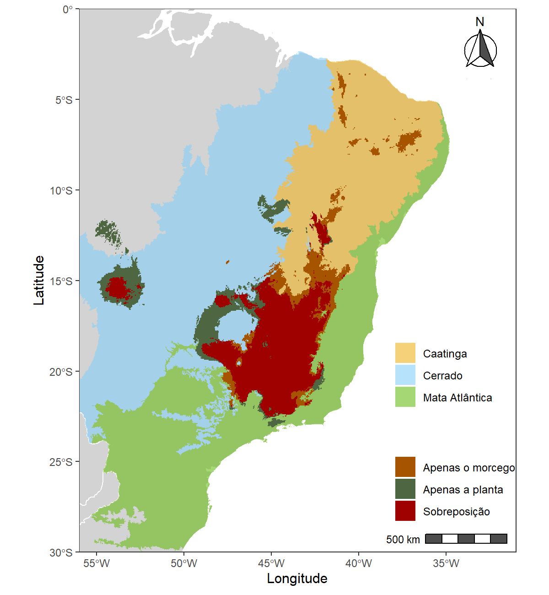

---
output:
    pdf_document:
    latex_engine: xelatex
html_document:
    df_print: paged
toc: yes
theme: united
editor_options:
    markdown:
    wrap: sentence
intent: yes
link-citations: yes
linestretch: 1.25
indent: yes
fontsize: 11pt
csl: associacao-brasileira-de-normas-tecnicas-eceme.csl
---

# 5. Discussão

|     Desenvolvemos modelos correlativos com base unicamente em variáveis bioclimáticas, a fim de uma primeira tentativa de acesso aproximado aos impactos potenciais das mudanças climáticas na distribuição da espécie de quiróptero *Lonchophylla bokermanni* Sazima e colab., 1978, e seu parceiro mutualista, a bromélia *Encholirium subsecundum* (Baker) Mez. 


Os modelos para ambas as espécies mostraram que sob os dois cenários climáticos futuros, é esperado redução de ambientes adequados, o que aumenta ainda mais sob o RCP (*Respresentative Concentration Pathway*) 8.5, o mais extremo. *E. subsecundum* apresentou as alterações mais severas em sua distribuição, chegando a perder até 81% de área potencial sob o cenário de RCP 8.5, em relação à área do presente ([figura 14](#figuras)). *L. bokermanni* também teve sua distribuição potencial afetada de maneira aguda, perdendo até 58% de sua área potencial original no RCP 8.5 ([figura 19](#figuras)). A maior perda de habitat sob o cenário pessimista sugere menor tolerância das espécies às mudanças climáticas mais intensas, além de ambas demonstarem a tendência de contrair suas distribuições em direção ao bioma da Mata Atlântica.


Nos RCPs futuros, as espécies apresentaram perda significativa de distribuição potencial nos biomas do Cerrado e da Caatinga ([figuras 13, 14, 18 e 19](#figuras)). A aptidão à perda de habitat no Cerrado pelas espécies é plausível a medida em que o bioma é bastante ameaçado devido a processos antrópicos de uso exploratório do solo, desmatamento e queimadas, afetando diretamente o clima [@carneiro2016; @inpe]. O panorama negativo é previso ainda a continuar, com previsões climáticas indicando intesificação dos períodos de seca e alterações no ciclo hidrológico do Cerrado no futuro [@marinez2003; @arantes2016; @pbmc2013]. 


A área de sobreposição espacial potencial entre ambas as espécies também apresentou propensão a contração nos cenários futuros, perdendo quase 80% da área de sobreposição com respeito ao presente, sob o cenário de RCP 8.5 ([figura 4](#discussão)). Porém, a relação entre a sobreposição e a distribuição potencial é distinta entre ambas as espécies. *L. bokermanni* mostrou diminuição na taxa de sobreposição com relação à sua distribuição nos cenários futuros, obtendo apenas 36.9% de sobreposição espacial com a planta no cenário de RCP 8.5 ([tabelas 8 e 9](#apêndice)). Nos dois cenários climáticos futuros analisados, os modelos mostraram que mais de 60% da distribuição potencial do morcego não possuía correspondência espacial com a planta, caracterizando o *mismatch* espacial [@schweiger2008; @hegland2008] por parte do morcego. 


Em contrapartida, *E. subsecundum* apresentou aumento na taxa de sobreposição em relação a sua distribuição nos cenários futuros ([tabelas 8 e 9](#apêndice)), chegando a uma porcentagem alta de 84.9% de sobreposição sob RCP 4.5, o que implica que apenas 15.1% de sua distribuição potencial nesse cenário está em desencontro geográfico com o morcego. No RCP 8.5, o desencontro espacial cresce para 23.3% da área potencial da planta. 


Os resultados do projeto apontam portanto a possibilidade de não ocorrer o *mismatch* espacial com respeito à distribuição da planta, a qual pode chegar a aumentar a sobreposição com o morcego, dando suporte a uma das hipóteses iniciais de que o *mismatch* pode ocorrer apenas com relação à distribuição do morcego, e não com a da planta. Uma explicação plausível é a de que o crescimento relativo na sobreposição espacial pela planta seria devido à contração geográfica da mesma, de tal forma que uma distribuição menor de *E. subsecundum* seja mais provável de estar sobreposta com a de *L. bokermanni*, especialmente caso a distribuição do morcego sofra menor perda de área no futuro.


Consideramos no projeto que os habitats adequados para *E. subsecundum* nos quais não há a presença de *L. bokermanni* não representam habitats viáveis para a espécie, de maneira analóga o mesmo foi considerado para *L. bokermanni*, seguindo o método adotado por @gorostiague2018. Desta forma, em habitats sem a presença da espécie parceira entendemos que há a falta da interação mutualista e em ambientes com ambas as espécies a interação ocorre, considerando que a interação é contínua ao longo do espaço e tempo e eficiente [@gorostiague2018; @anderson2016]. 


Faltam conhecimentos sobre as características da interação mutualista entre *L. bokermanni* e *E. subsecundum*, o que limita a capacidade de avaliação e as suposições feitas com base nos modelos. Considerando a estrutura aninhada de redes de polinização [@jordi2003] e a tendência a generalização entre as interações planta-polinizador [@waser1996] é razoável pensar se na falta da interação com o morcego por conta de *mismatch* espacial, *E. subsecundum* possui ou possuirá espécies que também a polinizem de maneira efetiva. A mesma questão é válida para *L. bokermanni*, caso diante de uma lacuna entre a interação mutualista com a bromélia, haveriam espécies de plantas compensatórias da qual pudesse se alimentar. 


@anderson2013 recomendou o uso de outros dados além das variáveis climáticas para a modelagem de predições futuras, como abilidade de dispersão e demografia das espécies. Pela falta de dados sobre a ecologia das espécies, optamos por utilizar apenas variáveis bioclimáticas e os parâmetros padrão para o Maxent, na tentativa de evitar inacurácia elevada pelos modelos. Por causa disso, os nossos modelos não possuem a pretenção de prever exatamente a distribuição das duas espécies, mas tentar apresentar a direção com que as mudanças climáticas podem alterar as distribuições e a sobreposição espacial entre a planta e o morcego.  


Diversos autores apresentaram a relação positiva entre a quantidade de dados de ocorrências das espécies e a capacidade de predição dos algoritmos de modelagem [@hernandez2006; @hijmans2008], isto é, conforme a quantidade de ocorrências diminui, é esperado menor acurácia do modelo, o que desafia a modelagem de espécies raras. Há algumas razões para essa perda de performance, como 


Essa perda de performance dos modelos com poucos dados foi um fator importante e desafiador para o projeto na medida em que a quantidade de ocorrências disponíveis para *Lonchophylla bokermanni* na literatura e bancos de dados online é pequena. Dessa forma, isso foi levado em conta para a tomada de decisão de aspectos fundamentais do processo de modelagem, como a escolha do algoritmo. A utilização do Maxent mostrou-se positiva ao avaliar que os modelos gerados por ele obtiveram bons valores de AUC ([figuras 8 e 9](#figuras)), inclusive para a espécie de morcego.


```{r mapa_sob_presente, echo=FALSE, fig.align='center', fig.cap='Mapa de sobreposição entre as distribuições da planta e do morcego no presente.', fig.show="hold", out.width="60%"}



```


\clearpage
```{r mapas_sob, echo=FALSE, fig.align='center', fig.cap='Mapas de sobreposição entre as distribuições da planta e do morcego no RCP 4.5 (acima) e RCP 8.5 (abaixo).', fig.show="hold", out.width="61%"}

knitr::include_graphics(c("../Graficos/sobreposicoes_mapas_feitos/RCP45.jpeg", "../Graficos/sobreposicoes_mapas_feitos/RCP85.jpeg"))

```


