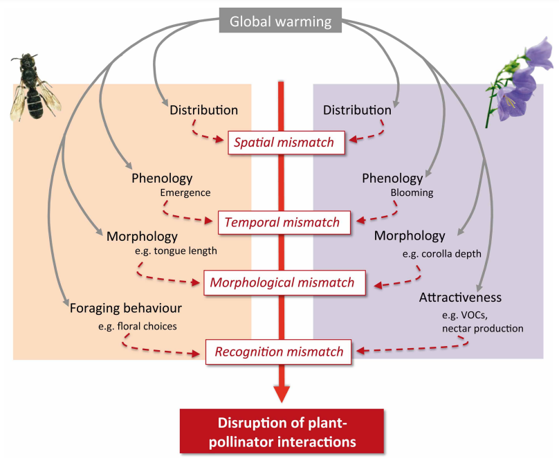

---
output:
  pdf_document:
    latex_engine: xelatex
  html_document:
    df_print: paged
    toc: yes
    theme: united
editor_options:
  markdown:
    wrap: sentence
intent: yes
link-citations: yes
linestretch: 1.25
indent: yes
fontsize: 11pt
csl: associacao-brasileira-de-normas-tecnicas-eceme.csl
---

\clearpage

# 1. Fundamentação teórica

## 1.1 Mudanças climáticas, alteração na distribuição de espécies e *mismatch* espacial

|      A distribuição de uma espécie se caracteriza pela área geográfica a qual ela pode ser encontrada [@putten2012], o que é estabelecido por uma série de fatores determinados pelo nicho ecológico da espécie [@begon2005]. Ao serem afetadas por transformações do clima, a população de uma espécie pode ter três desfechos possíveis: adaptação às novas condições, extinção local ou migração para novos ambientes adequados à sobrevivência da espécie [@parmesan2006; @gorostiague2018]. 

Diversas observações de alterações na distribuição de espécies em paralelo às mudanças climáticas (compreendido aqui principalmente como o aquecimento do clima global) já foram documentadas ao redor do globo [@parmesan2003; @walther2002]. Essas alterações podem ter escalas muito distintas entre as espécies, algumas podem ter repostas evolutivas adequadas quanto às mudanças na distribuição devido ao aquecimento do clima [@chen2011], enquanto que outras tendem a não responder de maneira adequada e acabarem extintas localmente [@parmesan2006]. 

Embora as respostas evolucionárias de alteração na distribuição tenham proporções distintas, observa-se uma tendência de muitas espécies a mudarem suas distribuições em direção altitudes maiores e latitudes polares [@chen2011, @parmesan2003; @parmesan2006]. Nas regiões tropicais, espécies seguem a mesma tendência ao movimento para áreas mais temperadas [@parmesan2006].

Além do mais, tem sido indicado que as mudanças climáticas podem pertubar interações ecológicas entre espécies, podendo levar ao chamado *mismatch* espacial (ruptura ou diminuição das interações ecológicas em razão do desencontro geográfico das espécies) [@schweiger2008; @hegland2008]. Pelas respostas evolutivas às mudanças climáticas não acontecerem de formas iguais é que ocorrem os *mismatches*. @gorostiague2018 apontou que as chances que a população de uma espécie tem de colonizar novos habitats depende da possibilidade de que as espécies das quais ela dependa também expandam sua distribuição (*match* espacial com seus parceiros mutualistas), caso o contrário ocorrerá o *mismatch* espacial.

No caso de sistemas ecológicos planta-polinizador, há uma grande preocupação em compreender como as mudanças climáticas podem afetar as distribuições de plantas e seus polinizadores e também os impactos dos *mismatches* sobre os mesmos, tendo em vista a contribuição ambiental desses sistemas e o papel ecológico nos ecossistemas [@begon2005; @kearns1998]. 

Para as plantas, o *mismatch* com polinizadores efetivos poderia causar a redução da deposição do pólen, aumentando a restrição deste, segundo @hegland2008. É comum em diversas espécies de plantas a limitação da reprodução devido a polinização insuficiente, conhecido como *Efeito Allee*. Quanto aos polinizadores, pode-se esperar que o desencontro com plantas importantes à alimentação leve a uma redução na quantidade e acesso a alimentos, afetando diretamente sua sobrevivência.  @hegland2008 também discute que os efeitos dos *mismatches* podem ser mais rigoroso aos polinizadores, pois a dependência dos polinizadores na nutrição é maior do que a dependência das plantas que florescem na polinização. Contudo, a força com que espécies de polinizadores são afetados pelos *mismatches* pode depender dos traços funcionais (características fisiológicas, fenológicas e morfológicas) das espécies, como no caso de morcegos polinizadores [@gutierrez2021].

{width="60%"}

Apesar dos possíveis efeitos negativos causados pelos *mismatches*, algumas características de muitos sistemas planta-polinizador podem agir para minimizar os impactos, como a estrutura aninhada de redes de polinização, na qual um núcleo de espécies generalistas interagem entre si e as espécies especilistas dessa rede interagem apenas com as generalistas [@hegland2008; @jordano2003]. Ademais, há mais espécies generalistas nessas redes do que especialistas, sendo que relações de um único polinizador para uma planta são incomuns, o que pode contribuir para que muitas espécies não sejam afetadas gravemente pelos *mismatches*. Por fim, a maioria das interações de polinização são assimétricas, isto é, caso uma planta seja importante para um polinizador, então a importância desse polinizador para a planta é baixa [@hegland2008; @gutierrez2021].

Por mais que essas propriedades das redes de polinização possam atuar como estabilizadores diante de distúrbios, as redes de polinização ainda podem ser enfraquecidas pelos impactos negativos dos *mismatches*. Tem sido proposto que em sistemas nos quais interações são formadas por generalistas, os polinizadores mostrem maior plasticidade para se adequar às mudanças, enquanto que em sistemas com espécies especialistas exista menor flexibilidade nas respostas, estando portanto mais vulneráveis [@memmott2007; @rafferty2012]. Espécies com distribuição restrita também podem ser mais frágeis, ao passo que são mais propícias a perderem habitat e serem extintas do que espécies com distribuições maiores [@staude2020].

## 1.2 Modelos de Distribuição de Espécies (MDEs)

|     Os MDEs são ferramentas criadas para a predição da distribuição de espécies ao longo de áreas não amostradas a partir de algoritmos de computação que usam dados de ocorrências (ou ausência) de espécies e dados ambientais. Existem dois tipos principais de Modelos de Distribuição, correlativos e mecanísticos. Enquanto que estes incorporam características fisiológicas das espécies nos modelos, aqueles exploram a associação espacial entre os dados ambientais e de ocorrência da espécie [@kearney2010]. 

Diversos algoritmos de modelagem correlativa podem ser encontrados, os quais possuem diferentes tratamentos matemáticos e computacionais para os dados recebidos, mas de maneira simplificada, os algoritmos dos MDEs recebem como *input* do usuário os registros de localidades de uma dada espécie (a distribuição observada) e as camadas ambientais (mais comumente dados climáticos de temperatura e precipitação) preditoras da distribuição da espécie. Assim, o algoritmo utiliza a distribuição observada como uma função de condições ambientais para criar um modelo de distribuição da espécie que avalia quais características de habitat são importantes à espécie, diante dos dados de treino [@elith2009]. O modelo pode ser então aplicado para tempos climáticos do presente ou outros, gerando como *output* os mapas com as predições da distribuição potencial para a espécie [@elith2009; @miller2010]. 

Os MDEs desempenham papel importante para a identificação de áreas potenciais à conservação, com risco de propagação de vetores de doenças, potenciais espécies invasoras etc [@miller2010; @Lopez2011]. Porém com a crescente preocupação com o impacto das mudanças climáticas, os MDEs tornaram-se essenciais para compreender a resposta de espécie e comunidades à alterações futuras no clima global. 

Quanto ao *mismatch* espacial e sobreposição da distribuição de espécies, MDEs são instrumentos que podem prover estimativas confiáveis da distribuição futura de espécies que possuem interações ecológicas, auxiliando a avaliar o potencial de *mismatch* espacial. [@gorostiague2018] buscou compreender os possíveis impactos das mudanças climáticas em 11 espécies de cacto dos Andes e o sobreposição espacial com seus respectivos polinizadores através de modelos correlativos de distribuição, estimando contração na distribuição das espécies no futuro, porém diminuição no *mismatch* espacial entre elas. [@gomez2019] também utilizou da modelagem de distribuição para avaliar a sobreposição potencial de espécies de *Agave* e seus morcegos polinizadores no presente e em projeções futuras, encontrando uma diminuição da sobreposição entre as espécies.

