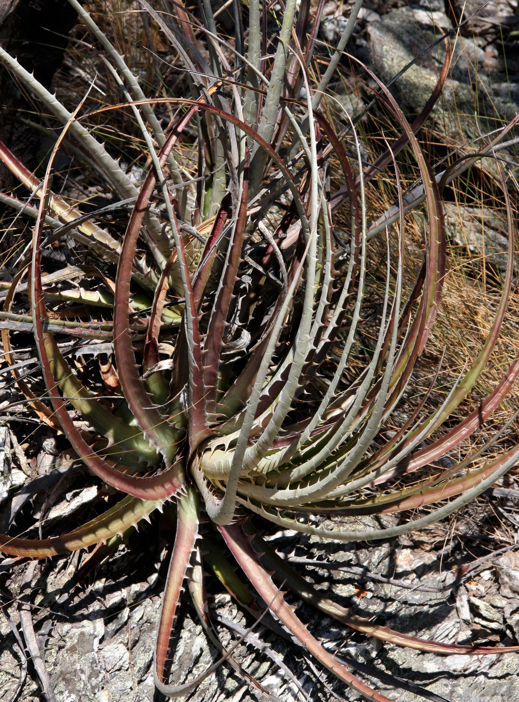

---
output:
  pdf_document:
    latex_engine: xelatex
  html_document:
    df_print: paged
    toc: yes
    theme: united
editor_options:
  markdown:
    wrap: sentence
intent: yes
link-citations: yes
linestretch: 1.25
indent: yes
fontsize: 11pt
csl: associacao-brasileira-de-normas-tecnicas-eceme.csl
---

\clearpage

# 3. Materiais e métodos

## 3.1 Espécies 

|     Modelamos a distribuição de 2 espécies: a de quiróptero *Lonchophylla bokermanni* Sazima *et al.*, 1978, e de bromélia *Encholirium subsecundum* (Baker) Mez.

*L. bokermanni* Sazima *et al.*, 1978 [@sazima1978; @dias2013] é uma espécie de morcego de porte médio endêmica do Brasil, fazendo parte do gênero *Lonchophylla* (família Phyllostomidae), que abrange espécies nectarívoras, com focinho alongado e língua comprida [@fleming2008].
Com poucas ocorrências no bioma do Cerrado e da Caatiga, em Minas Gerais e Bahia ([tabela 2](#apêndice)), o quiróptero possui uma distribuição restrita [@claudio2018].
Ainda pouco se conhece sobre a biologia da espécie, porém sabe-se que alimenta-se de pólen, néctar e insetos [@moratelli; @dias2013].

Em razão da degradação de seus habitats, a classificação de *L. bokermanni* quanto ao seu grau de ameaça está como "Em perigo" de acordo com a Listade Espécies Ameaçadas da União Internacional para a Conservação da Natureza (IUCN) [@claudio2018] e como "Quase ameaçada" pelo Instituto Chico Mendes de Conservação da Biodiversidade (ICMBio) [@icmbio2018].

{width="40%"}

*Encholiirum subsecundum* (Baker) Mez é uma espécie de bromélia do gênero 
*Encholirium* (família Bromeliaceae) que ocorre em formações rochosas, podendo atingir até 2 metros de altura e com um padrão floral quiropterófilo [@matos2004; @dias2013]. A espécie é endêmica do Brasil, com ocorrências nos biomas da Caatinga, Mata Atlântica e, principalmente, no Cerrado [@matos2004; @forzza2005; @sazima1989], nos estados de Minas Gerais e Bahia ([tabela 1](#apêndice)). Embora existam outras espécies de morcegos nectarívoros na área de ocorrência de *E. subsecundum*, *L. bokermanni* é o único polinizador conhecido da bromélia [@sazima1989]. *E. subsecundum* não se encontra no Livro Vermelho da Flora do Brasil [@martinelli2013] ou na Lista Vermelha da IUCN [@iucn].

{width="40%"}


## 3.2 Ocorrências

|     Para o processo de Modelagem de Distribuição são necessários registros georreferenciados das espécies. Assim, foram coletados os registros de ocorrências de *Encholirium subsecundum* e *Lonchophylla bokermanni* em 3 bancos de registros onlines: Specielink, GBIF e SiBBr, que reunem registros de coleções de espécies. Também foram utilizados registros de artigos que fizeram coletas de espécies. 

Foram reunidos 24 registros ao todo da espécie *L. bokermanni*, com o único parâmetro prévio de possuírem coordenadas georreferenciadas. Em seguida, os registros com coordenadas geográficas duplicadas foram retirados da base de dados, sobrando apenas uma ocorrências entre as duplicadas. Então, um *buffer* com raio de 5 km foi criado ao redor de cada registro e foram selecionados apenas uma ocorrência dentro de cada *buffer*, a fim de diminuir o viés amostral na seleção de ocorrências pelo modelo [@hijmans2001]. Por fim, sobraram 8 registros, os quais foram utilizados para as modelagens ([tabela 2](#apêndice)).


O mesmo método de limpeza e tratamento dos registros de ocorrência foram utilizados com os dados da *E. subsecundum*, inicialmente com 82 registros e após a retirada de registros duplicados e seleção de um registro por *buffer*, restaram 37 ocorrências de localidade da espécie ([tabela 1](#apêndice)) que foram utilizados nas modelagens.


Todos as ocorrências restantes tiveram a descrição de município e localidades dos registros confrontados com os pontos de georreferenciamento (latitude e longitude), com o objetivo de verificar se estavam de acordo. Nenhum registro restante possuía descrição de localidade que não estivesse de acordo com a posição geográfica descrita. 


```{r plot_bokermanni, echo=FALSE, fig.align='center', fig.cap='Gráfico das localidades de L. bokermanni (à esquerda) e E. subsecundum (à direita).', fig.show="hold", out.width="49%"}


knitr::include_graphics(c("../Graficos/Figure_1.png", "../Graficos/Figure_2.png"))

```


## 3.3 Dados ambientais

|     Para produzir os modelos de distribuição potencial das espécies utilizamos camadas ambientais obtidas do projeto WorldClim [@worldclim], com resolução espacial de 2.5 arc-minutos (aproximadamente 4.5 km no equador) e representando o clima atual, correspondendo à média das observações de 1970 a 2000. 
  As 19 variáveis bioclimáticas ([tabela 3](#apêndice)) derivam de dados de temperatura e precipitação, repesentando tendências anuais, condições extremas e sazionalidade [@IPCC; @worldclim].

Para as predições de distribuições futuras, utilizamos camadas projetadas do clima global para o ano de 2050 (média de 2041 a 2060) de acordo com o Quinto Relatório de Avaliação do Painel Intergovernamental sobre Mudanças Climáticas (AR5) do Painel Intergovernamental sobre Mudanças Climáticas [@IPCC], obtidas também através do projeto WorldClim [@worldclim].
São camadas de 19 biovariáveis ([tabela 3](#apêndice)) projetadas para o futuro, com resolução de 2.5 arc-minutos e usando o modelo de circulação CNRM-CM5, do laboratório francês *Centre National de Recherches Meteorologiques*, representando dois cenários distintos de emissão de gases do efeito estufa conforme o *Representative Concentration Pathways* (RCPs), o de RCP 45 (cenário no qual as emissões de $CO_2$ começam a diminuir a partir de 2045) e de RCP 85 (as emissões de gases continuam a crescer ao longo do século 21) [@Vuuren2011].

Diversos autores apontaram problemas de multicolinearidade de variáveis climáticas em modelagens de distribuição [@braunisch2013; @cardenas2014], afetando diretamente os resultados e performance dos modelos.
A fim de avaliar a gravidade da colinearidade entre os pontos de ocorrências das duas espécies e o conjunto de biovariáveis do clima atual, medimos o Fator de Inflação da Variância (VIF) das camadas ambientais.
Para os dados de ocorrência da planta *E. subsecundum*, o teste resultou em 12 (de 19) variáveis bioclimáticas com problemas de colinearidade ([tabela 4](#apêndice)).
Enquanto que para o morcego *L. bokermanni*, 17 variáveis apresentaram alto grau de colinearidade ([tabela 5](#apêndice)).
Valores de VIF maiores que o limiar 10 já indicam problema de colinearidade.

```{r VIF_subs, echo=FALSE, fig.align='center', fig.cap='Matriz de correlação entre as variáveis bioclimáticas para a espécie E. subsecundum (à esquerda) e L. bokermanni (à direita)', fig.show="hold", out.width="49%"}

knitr::include_graphics(c("../Dados/Resultados_VIF/E_subsecundum/Corr_plot_19_biovars.png","../Dados/Resultados_VIF/L_bokermanni/Corr_plot_19_biovars.png"))

```

## 3.4 Modelo de Distribuição Potencial

|     Para o processo de modelagem foi utilizado o pacote SDM (*Species Distribution Modelling*) [@sdm], (versão 1.0-89), da linguagem de programação R [@r], versão 4.1.1, por apresentar uma série de funções importantes que automatizam o processo de modelagem, além de conter diversos algoritmos de modelagem.


Nós usamos o algoritimo correlativo de modelagem de distribuição Maxent (*Maximum Entropy*) [@maxent], versão 3.4.4, disponível no pacote SDM. Maxent é um *software*, de uso livre, para a modelagem da distribuição potencial de espécies a partir da técnica de *machine learning* conhecida como *maximum entropy modeling*. 


Maxent recebe como *input* as ocorrências georreferenciadas da espécie e o conjunto de dados camadas ambientais (variáveis preditoras) determinados pelo usuário e dividido em *grid cells* ao longo de uma região escolhida [@merow2013]. Diante disso, o algoritmo amostra uma quantidade de localizações de *background* das camadas ambientais, que são confrontadas com as localizações geográficas da espécie, gerando como *output* um modelo que traduz a probabilidade de distribuição da espécie para cada *grid cell*, dada a aptidão às condições ambientais preditas para a espécie. Maxent procura, assim, a distribuição mais espalhada (de entropia máxima) para a espécie na região de estudo.


O algoritmo foi escolhido devido a sua performance superior a outros quando utilizado quantidades pequenas de dados de ocorrência das espécies [@hijmans2008; @hernandez2006], crucial para nós devido a quantidade pequena de dados para a espécie de morcego *L. bokermanni*. Além disso, Maxent requer apenas ocorrências de presença das espécies, excluindo a necessidade de registros de ausência e facilitando o trabalho com espécies que possuem baixa quantidade de registros ou não possuam registros de ausência.


Como parâmetros de modelagem para o Maxent, utilizamos regularização igual a 1 e prevalência de 50%, ambos valores padrão. O parâmetro de extrapolação e *clamping* foram permitidos para gerar predições além da distribuição presente das espécies. Para cada espécie foram geradas 50 replicações, metade usando o método de validação por *bootstrap* e a outra metade por subamostragem. 70% dos registros de ocorrência foram separados e utilizados para treino e 30%  para o teste dos modelos. 10 mil pontos de *background* foram gerados aleatoriamente ao longo de cada camada ambiental, os quais foram usados para a modelagem como amostras das variáveis ambientais. Foram utilizados parâmetros padrão para a modelagem devido à falta de informação sobre o habitat e capacidade de dispersão das espécies modeladas. Para gerar um modelo consenso dentre as 50 replicações, usamos a média ponderada das área de distribuição das replicações.


Fizemos uma modelagem prévia para cada espécie com os parâmetros mencionados e todas as variáveis ambientais. A partir de então, as quatro camadas ambientais com maior importância para os modelos ([gráficos 6 e 7](#apêndice)), de acordo com o AUC, foram selecionadas e separadas. A variável com maior valor VIF e menor importância dentre as quatros selecionadas foi retirada e as três camadas restantes foram utilizadas em uma nova modelagem final, com os parâmetros apresentados no parágrafo anterior, que gerou as projeções dos modelos.


A fim de avaliar a performance dos modelos criados pelo Maxent, foi empregado o AUC (*Area Under the Curve*) parcial da curva ROC (*Receiver Operating Characteristic Curve*) [@maxent], obtido ao plotar valores de sensitividade no eixo y e 1-especificidade no eixo x e com valores variando de 0 (modelo com 100% de taxa de erro) a 1 (modelo totalmente em acordo com a distribuição observada). O AUC é uma medida estatística independente da escolha do limiar (*threshold*) e tornou-se muito popular para esimar a performance de modelos de distribuição. O valor de limiar para os modelos de cada espécie foi obtido a partir da maximização da especificidade mais a sensitividade [@liu2013], o qual é independente da quantidade de pseudo-ausências, o que pode ser vantajoso ao se utilizar pequenas quantidade de dados. Com o limiar é possível converter os mapas de adequabilidade das espécies para mapas binários (presença-ausência).


O modelo de cada espécie foi então projetado para os cenários futuros, de RCP 4.5 e 8.5, e para o presente gerando como saída 6 mapas de distribuição potencial, 3 da planta e 3 do morcego. Foram então elaborados 5 mapas finais para cada espécie: 3 que mostram as distribuições nos cenários e 2 com as alterações nas distribuições com respeito ao presente. Criamos também 3 mapas com as sobreposições entre as distribuições das espécies nos três cenários distrintos.


## 3.5 Estimativa da sobreposição e *mismatch* espacial 

|     Seguindo o método apresentado por @gorostiague2018, para o cálculo dos potenciais impactos das mudanças climáticas na distribuição espacial das espécies utilizamos uma variável da alteração na distribuição nos cenários futuros em relação à distribuição potencial no presente. Também estimamos a distribuição compartilhada (sobreposta) entre a planta e o morcego e então calculamos a diferença entre essa área nos cenários futuros com respeito ao presente. A distribuição compartilhada representa a área de encontro entre o morcego polinizador e a planta (*spatially matched range*), assumindo que o morcego é efetivo e sua presença já garante a polinização da planta. 

A taxa de correspondência espacial (*spatial match*) foi calculada como a diferença entre a distribuição potencial de cada espécie e a distribuição não compartilhada. A índice de *mismatch* é a taxa de correspondência espacial subtraída de 100. Valores de *mismatch* abaixo de 20% foram considerados baixos, isto é, menos de 20% da distribuição de uma espécie não está sobreposta com a distribuição da outra [@gorostiague2018].


## 3.6 Etapas do projeto

|     O projeto segue as etapas para Modelagem de Distribuição de Espécie propostas por @pinaya2013, organizada em 5 etapas: 1. Construção da hipótese científica; 2. Pré-análise dos dados; 3. Modelagem; 4. Predição e 5. Validação da hipótese científica.


1. Construção da hipótese científica: foi definida a proposta do projeto, assim como os objetivos e hipóteses científicas a serem testadas. 


2. Pré-análise dos dados: foram coletados os dados de ocorrência das espécies (descrito na seção 2.2) de banco de registros online e artigos ([tabela 1 e 2](#apêndice)), os registros foram então tratados. Nesta etapa, também foram obtidos as variáveis ambientais bioclimáticas para o uso na modelagem (descrito na seção 2.3). Os dados obtidos foram analisados a fim de verificar a viabilidade de utilizá-los.


3. Modelagem: diante dos dados obtidos, foi escolhido o algoritmo mais adequado para a modelagem de distribuição potencial (seção 2.4). As variáveis ambientais preditoras foram então selecionadas por meio de uma modelagem prévia para cada espécie, utilizando o algoritmo Maxent. Após selecionar as três camadas preditoras foi obtido um modelo final para cada espécie, o qual teve sua performance avaliada.


4. Predição: o modelo criado na etapa anterior foi utilizado para projetar a distribuição das espécies para o cenário climático presente e os do futuro, de RCP 4.5 e 8.5.


5. Validação da hipoótese científica: foram analisados os conjuntos de dados gerados pelos modelos de distribuição ([ver resultados](#resultados)), gerando os mapas de predição. A partir de então foi possível confrontá-los com as hipóteses propostas inicialmente.


## 3.7 Repositório dos códigos e dados

|     Todos os dados e códigos utilizados no projeto, desde a obtenção e limpeza dos dados de ocorrência à elaboração dos mapas, estão disponíveis na plataforma online de hospedagem de códigos GitHub em [https://github.com/guilhermechicarolli/PDPD](https://github.com/guilhermechicarolli/PDPD), podendo ser baixados e reproduzidos.