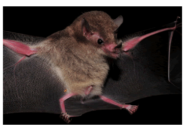

---
output:
  pdf_document:
    latex_engine: xelatex
  html_document:
    df_print: paged
    toc: yes
    theme: united
editor_options:
  markdown:
    wrap: sentence
intent: yes
link-citations: yes
linestretch: 1.25
indent: yes
fontsize: 11pt
csl: associacao-brasileira-de-normas-tecnicas-eceme.csl
---

\clearpage

# Materiais e métodos

## Espécies estudadas

Modelamos a distribuição de 2 espécies: a de quiróptero *Lonchophylla bokermanni* Sazima *et al.*, 1978, e de bromélia *Encholirium subsecundum* (Baker) Mez.

*L. bokermanni* Sazima *et al.*, 1978 [@sazima1978; @dias2013] é uma espécie de morcego de porte médio endêmica do Brasil, fazendo parte do gênero *Lonchophylla* (família Phyllostomidae), que abrange espécies nectarívoras, com focinho alongado e língua comprida [@fleming2008].
Com poucas ocorrências no bioma do Cerrado e da Caatiga, em Minas Gerais e Bahia [Tabela 2](#apêndice), o quiróptero possui uma distribuição restrita [@claudio2018].
Ainda pouco se conhece sobre a biologia da espécie, porém sabe-se que alimenta-se de pólen, néctar e insetos [@moratelli; @dias2013].

Em razão da degradação de seus habitats, a classificação de *L. bokermanni* quanto ao seu grau de ameaça está como "Em perigo" de acordo com a Listade Espécies Ameaçadas da União Internacional para a Conservação da Natureza (IUCN) [@claudio2018] e como "Quase ameaçada" pelo Instituto Chico Mendes de Conservação da Biodiversidade (ICMBio) [@icmbio2018].

{width="40%"}

*Encholiirum subsecundum* (Baker) Mez é uma espécie de bromélia do gênero 
*Encholirium* (família Bromeliaceae) que ocorre em formações rochosas, podendo atingir até 2 metros de altura e com um padrão floral quiropterófilo [@matos2004; @dias2013]. A espécie é endêmica do Brasil, com ocorrências nos biomas da Caatinga, Mata Atlântica e, principalmente, no Cerrado [@matos2004; @forzza2005; @sazima1989], nos estados de Minas Gerais e Bahia [Tabela 1](#apêndice). Embora existam outras espécies de morcegos nectarívoros na área de ocorrência de *E. subsecundum*, *L. bokermanni* é o único polinizador conhecido da bromélia [@sazima1989].


*E. subsecundum* não se encontra no Livro Vermelho da Flora do Brasil [@martinelli2013] ou na Lista Vermelha da IUCN [@iucn]


```{r plot_bokermanni, echo=FALSE, fig.align='center', fig.cap='Gráfico das localidades de L. bokermanni (à esquerda) e E. subsecundum (à direita)', fig.show="hold", out.width="49%"}


knitr::include_graphics(c("../Graficos/Figure_1.png", "../Graficos/Figure_2.png"))

```

## Modelo de Distribuição

## Dados ambientais

|     Para produzir os modelos de distribuição potencial das espécies utilizamos camadas ambientais obtidas do projeto WorldClim [@worldclim], com resolução espacial de 2.5 arc-minutos (aproximadamente 4.5 km no equador) e representando o clima atual, correspondendo à média das observações de 1970 a 2000. 
  As 19 variáveis bioclimáticas [Tabela 3](#apêndice) derivam de dados de temperatura e precipitação, repesentando tendências anuais, condições extremas e sazionalidade [@worldclim].

Para as predições de distribuições futuras, utilizamos camadas projetadas do clima global para o ano de 2050 (média de 2041 a 2060) de acordo com o Quinto Relatório de Avaliação do Painel Intergovernamental sobre Mudanças Climáticas (AR5) do Painel Intergovernamental sobre Mudanças Climáticas [@IPCC], obtidas também através do projeto WorldClim [@worldclim].
São camadas de 19 biovariáveis [Tabela 3](#apêndice) projetadas para o futuro, com resolução de 2.5 arc-minutos e usando o modelo de circulação ACCESS1, representando dois cenários distintos de emissão de gases do efeito estufa conforme o *Representative Concentration Pathways* (RCPs), o de RCP 45 (cenário no qual as emissões de $CO_2$ começam a diminuir a partir de 2045) e de RCP 85 (as emissões de gases continuam a crescer ao longo do século 21) [@Vuuren2011].

Diversos autores apontaram problemas de multicolinearidade de variáveis climáticas em modelagens de distribuição [@braunisch2013; @cardenas2014], afetando diretamente os resultados e performance dos modelos.
A fim de avaliar a gravidade da colinearidade entre os pontos de ocorrências das duas espécies e o conjunto de biovariáveis do clima atual, medimos o Fator de Inflação da Variância (VIF) das camadas ambientais.
Para os dados de ocorrência da planta *E. subsecundum*, o teste resultou em 13 (de 19) variáveis bioclimáticas com problemas de colinearidade [Tabela 4](#apêndice).
Enquanto que para o morcego *L. bokermanni*, 17 variáveis apresentaram alto grau de colinearidade [Tabela 5](#apêndice).
Valores de VIF maiores que o limiar 10 já indicam problema de colinearidade.

```{r VIF_subs, echo=FALSE, fig.align='center', fig.cap='Matriz de correlação entre as variáveis bioclimáticas para a espécie E. subsecundum (à esquerda) e L. bokermanni (à direita)', fig.show="hold", out.width="49%"}

knitr::include_graphics(c("../Dados/Resultados_VIF/E_subsecundum/Corr_plot_19_biovars.png","../Dados/Resultados_VIF/L_bokermanni/Corr_plot_19_biovars.png"))

```
