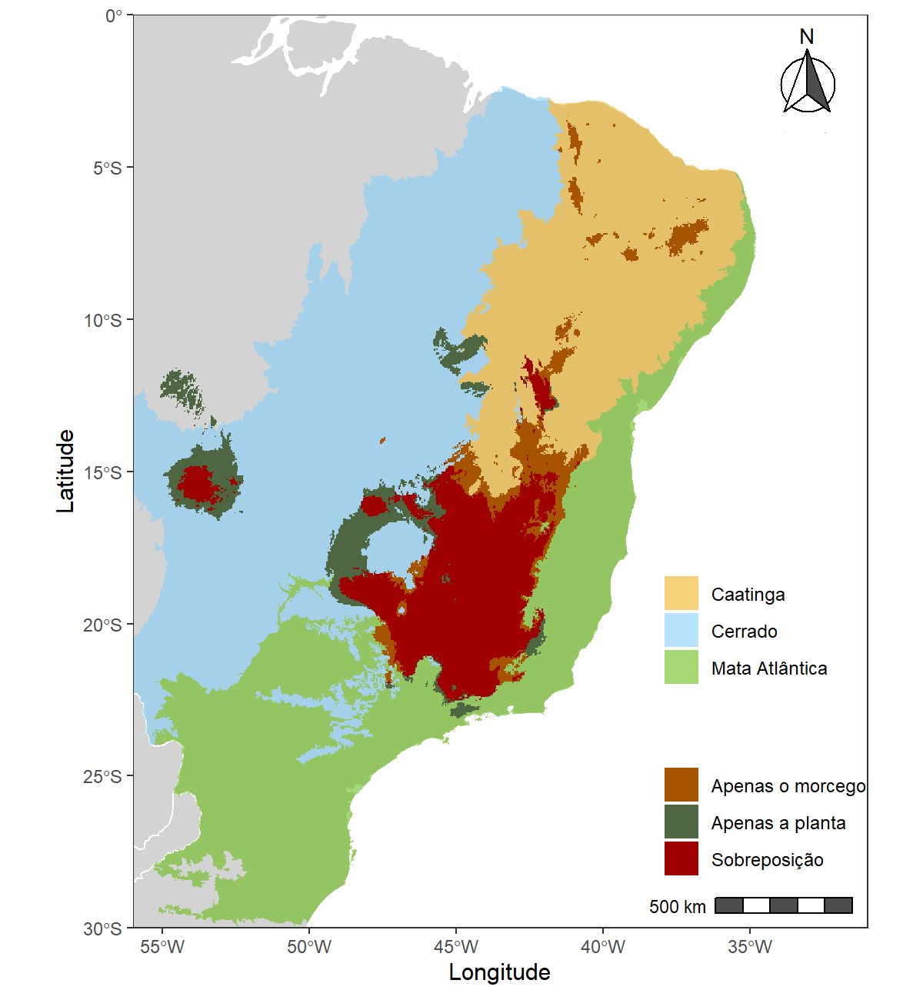

---
output:
  pdf_document:
    latex_engine: xelatex
  html_document:
    df_print: paged
    toc: yes
    theme: united
editor_options:
  markdown:
    wrap: sentence
intent: yes
link-citations: yes
linestretch: 1.25
indent: yes
fontsize: 11pt
csl: associacao-brasileira-de-normas-tecnicas-eceme.csl
---

\clearpage

# 4. Resultados

|      O algoritmo Maxent demonstrou boa performance preditiva, obtendo altos valores médios de AUC ([gráficos 8 e 9](#figuras)). A proporção de área potencial ganha e perdida sob os diferentes cenários climáticos com relação ao presente variou entre ambas as espécies ([figuras de 10 a 12 e 15 a 17](#figuras)), todas apresentaram contração na área ambiental adequada nos cenários futuros de mudanças climáticas. 

Os modelos previram redução de 36.98% de áreas adequadas (com respeito à área presente) para *Lonchophylla bokermanni* no cenário de RCP 4.5 para o ano de 2050 e diminuição de 58.06% de área para o panorama de RCP 8.5, para 2050 ([tabela 8](#anexos)). A mesma tendência foi observada para *Encholirium subsecundum*, a qual previmos encolhimento de 72.70% de área apropriada (relativa à área do presente) para o futuro de RCP 4.5 (2050), enquanto que no cenário de RCP 8.5 a redução na área é de 81.11%.\newline 


Tabela 1: Área potencial (em $km^{2}$) das espécies de acordo com o presente e os dois cenários climáticos futuros. 

| Espécie                   | Cenário climático | Área potencial |
|---------------------------|-------------------|----------------|
| *Lonchophylla bokermanni* | Presente          | 499674.7       |
|                           | RCP 4.5 (2050)    | 309803.4       |
|                           | RCP 8.5 (2050)    | 201510.3       |
| *Encholirium subsecundum* | Presente          | 513506.5       |
|                           | RCP 4.5 (2050)    | 140215.9       |
|                           | RCP 8.5 (2050)    | 97012.5        |


Previmos uma diminuição na área de sobreposição potencial entre a distribuição de ambas as espécies (planta+morcego), a qual diminui 67.76% no cenário de RCP 4.5 e 79.86% no RCP 8.5, em relação à sobreposição no presente ([tabela 2](#resultados)). O *mismatch* espacial (desacoplamento geográfico) entre a planta e o morcego aumentou com relação à distribuição de *Lonchophylla bokermanni*, que apresentou 26.07% de sua distribuição potencial presente sem sobreposição com a da planta. No cenário de RCP 4.5, 61.56% da área do morcego não apresentou sobreposição e no RCP 8.5, 63.07% de sua área.

Em contrapartida, observamos diminuição no *mismatch* para *Encholirium subsecundum*, previmos que 28.06% de sua área presente não tenha sobreposição com a distribuição do morcego. No futuro RCP 4.5, apenas 15.07% da área não apresentou sobreposição e no RCP 8.5, 23.30% da área ([tabela 9](#anexos)). 

>       

Tabela 2: Distribuição com sobreposição (planta+morcego) nos 3 cenário climáticos e alteração com respeito à sobreposição do presente.

+-------------------+--------------------------------+-------------------------------------------------------------------+------------------------------------------------------------------+
| Cenário climático | Área de sobreposição ($km{2}$) | Sobreposição com relação à distribuição do morcego no cenário (%) | Sobreposição com relação à distribuição da planta no cenário (%) |
+===================+================================+===================================================================+==================================================================+
| Presente          | 369410.9                       | 73.93                                                             | 71.94                                                            |
+-------------------+--------------------------------+-------------------------------------------------------------------+------------------------------------------------------------------+
| RCP 4.5 (2050)    | 119088.6                       | 38.44                                                             | 84.93                                                            |
+-------------------+--------------------------------+-------------------------------------------------------------------+------------------------------------------------------------------+
| RCP 8.5 (2050)    | 74409.3                        | 36.92                                                             | 76.70                                                            |
+-------------------+--------------------------------+-------------------------------------------------------------------+------------------------------------------------------------------+


```{r mapa_sob_presente, echo=FALSE, fig.align='center', fig.cap='Mapa de sobreposição entre as distribuições da planta e do morcego no presente.', fig.show="hold", out.width="70%"}



```


\clearpage
```{r mapas_sob, echo=FALSE, fig.align='center', fig.cap='Mapas de sobreposição entre as distribuições da planta e do morcego no  RCP 4.5 (acima) e no RCP 8.5 (abaixo).', fig.show="hold", out.width="61%"}

knitr::include_graphics(c("../Graficos/sobreposicoes_mapas_feitos/RCP45.jpeg", "../Graficos/sobreposicoes_mapas_feitos/RCP85.jpeg"))

```

